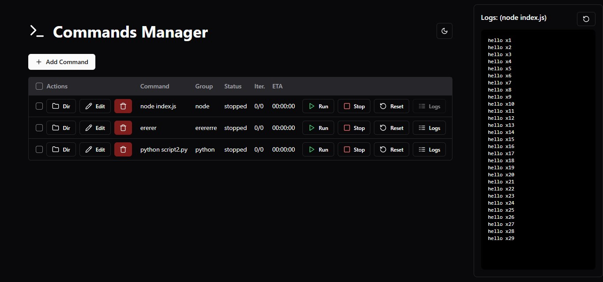

# Command Manager (Qaisar)

A real-time command execution manager with process monitoring capabilities built using Next.js, Express, and Socket.IO.

## Features

- 🔄 Real-time command execution and monitoring
- 📊 Live process status updates via WebSocket
- 📝 Command output logging and persistence
- 🎯 Process management (start, stop, reset)
- 🌗 Dark/Light theme support
- 📁 Directory navigation integration
- 🔍 Group-based command organization



## Tech Stack

### Frontend (cmdsman-ui)
- Next.js 14
- React Query
- Socket.IO Client
- TailwindCSS
- Radix UI Components
- TypeScript

### Backend (server)
- Express
- Socket.IO
- Execa (for process management)
- TypeScript

## Getting Started

1. Clone the repository:
```bash
git clone https://github.com/yourusername/cmdsman.git
cd cmdsman
```

2. Install dependencies:
```bash
# Install frontend dependencies
cd cmdsman-ui
npm install

# Install backend dependencies
cd ../server
npm install
```

3. Start the development servers:
```bash
# Start backend server (from server directory)
npm run dev

# Start frontend development server (from cmdsman-ui directory)
npm run dev
```

4. Open http://localhost:3000 in your browser

## Features in Detail
- Command Management
- Create, edit, and delete commands
- Specify working directory and command groups
- Real-time command execution monitoring
- Process status tracking (running, stopped, complete, incomplete)
- Real-time Updates
- Live command output streaming
- Process status updates
- Automatic reconnection handling User Interface
- Clean, modern interface with dark/light theme
- Responsive table view of commands
- Real-time logs viewer
- Easy-to-use command controls